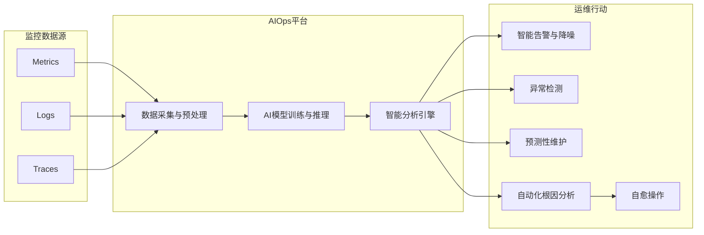

```mermaid
graph LR
    subgraph "监控数据源"
        M[Metrics]
        L[Logs]
        T[Traces]
    end
    subgraph "AIOps平台"
        AA[数据采集与预处理]
        AB[AI模型训练与推理]
        AC[智能分析引擎]
    end
    subgraph "运维行动"
        BA[智能告警与降噪]
        BB[异常检测]
        BC[预测性维护]
        BD[自动化根因分析]
        BE[自愈操作]
    end
    M --> AA
    L --> AA
    T --> AA
    AA --> AB
    AB --> AC
    AC --> BA
    AC --> BB
    AC --> BC
    AC --> BD
    BD --> BE
```