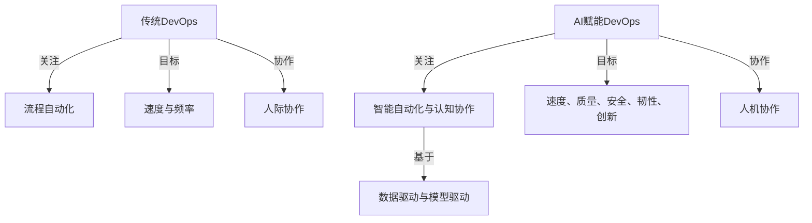

```mermaid
graph TD
    A[传统DevOps] -- 关注 --> B["流程自动化"];
    A -- 目标 --> C["速度与频率"];
    A -- 协作 --> D["人际协作"];

    E[AI赋能DevOps] -- 关注 --> F["智能自动化与认知协作"];
    E -- 目标 --> G["速度、质量、安全、韧性、创新"];
    E -- 协作 --> H["人机协作"];
    F -- 基于 --> I["数据驱动与模型驱动"];
```