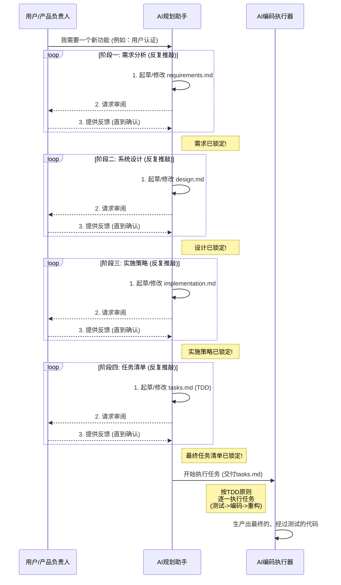

# 交互时序图

下图生动地展示了“用户”与“AI规划助手”如何在四个规划阶段中通过循环反馈进行协作，以及最终规划成果如何交付给“AI编码执行器”。

```mermaid
sequenceDiagram
    participant User as 用户/产品负责人
    participant Planner as AI规划助手
    participant Coder as AI编码执行器

    User->>Planner: 我需要一个新功能 (例如：用户认证)
    
    loop 阶段一: 需求分析 (反复推敲)
        Planner->>Planner: 1. 起草/修改 requirements.md
        Planner-->>User: 2. 请求审阅
        User-->>Planner: 3. 提供反馈 (直到确认)
    end
    Note right of Planner: 需求已锁定!

    loop 阶段二: 系统设计 (反复推敲)
        Planner->>Planner: 1. 起草/修改 design.md
        Planner-->>User: 2. 请求审阅
        User-->>Planner: 3. 提供反馈 (直到确认)
    end
    Note right of Planner: 设计已锁定!

    loop 阶段三: 实施策略 (反复推敲)
        Planner->>Planner: 1. 起草/修改 implementation.md
        Planner-->>User: 2. 请求审阅
        User-->>Planner: 3. 提供反馈 (直到确认)
    end
    Note right of Planner: 实施策略已锁定!

    loop 阶段四: 任务清单 (反复推敲)
        Planner->>Planner: 1. 起草/修改 tasks.md (TDD)
        Planner-->>User: 2. 请求审阅
        User-->>Planner: 3. 提供反馈 (直到确认)
    end
    Note right of Planner: 最终任务清单已锁定!

    Planner->>Coder: 开始执行任务 (交付tasks.md)
    Note left of Coder: 按TDD原则<br/>逐一执行任务<br/>(测试->编码->重构)
    Coder->>Coder: 生产出最终的、经过测试的代码
```
